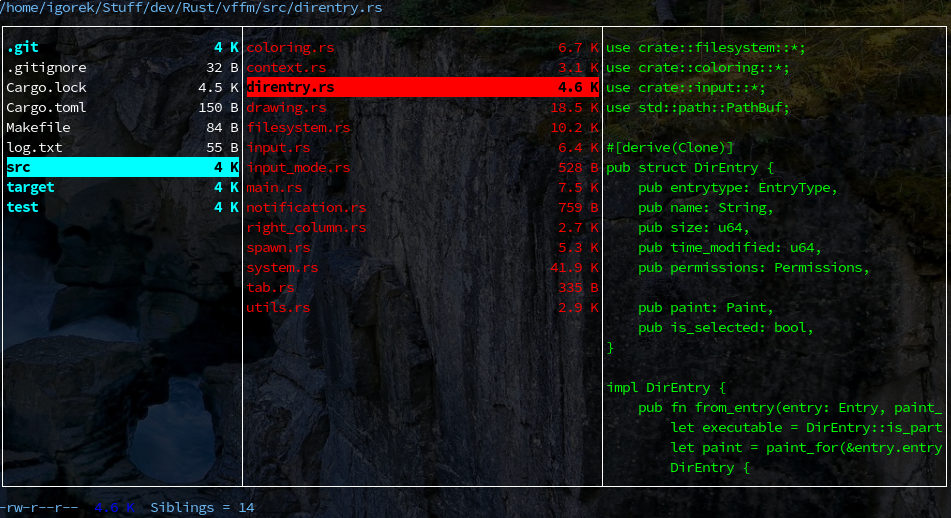

# vffm -- Very Fast File Manager #

The file manager you've always dreamt of but were afraid to desire!

Written in `Rust` using `ncurses` console graphics library with speed and efficiency in mind.

Uses vim-like keybindings for your convenience.

Supports tabs, search, copying, cutting, deleting, selecting, oppening, jumping to predefined locations.

